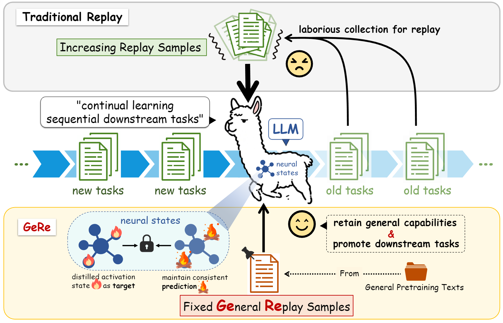

<h2 align="center"> <a href="https://github.com/Qznan/GeRe">GeRe: Towards Efficient Anti-Forgetting in Continual Learning of LLM via General Samples Replay</a></h2>
<p align="center">
  📄 <a href="https://arxiv.org/abs/2508.04676">Paper</a> | 💻 <a href="https://github.com/Qznan/GeRe">Code</a>
</p>
<!-- # 🌟 GeRe: Towards Efficient Anti-Forgetting in Continual Learning of LLM via General Samples Replay 🧠🔄 -->


[](https://arxiv.org/abs/2508.04676)


🚀 **Official Implementation** of **GeRe** - A novel replay framework for continual learning of Large Language Models, designed to mitigate forgetting through general samples replay and activation state constraint. 

<p align="center">
    
</p>

**Traditional replay vs. GeRe**: unlike traditional replay
requiring laborious collection of an increasing set of downstream replay samples, GeRe simply employs a fixed set of
general replay samples to not only retain general capabilities
in continual learning, but also enhance the overall performance of learned downstream tasks. The blue oval is the
threshold-based margin loss that imposes consistency constraint on neural activation state under GeRe frameworks.

## 🔥 News
- [2025/08/06]  🎉 Initial release of **[Paper](https://arxiv.org/abs/2508.04676)** and **[GeRe](https://github.com/Qznan/GeRe)** framework! GeRe is now available as a plug-and-play package, enabling seamless integration into your existing applications.


## 📦 Quick Start

### 1. Clone the project:
```bash
git clone https://github.com/Qznan/GeRe
cd GeRe
```

💡 Tip: We recommend the following package version for optimal compatibility (Optional):  
` torch==2.2.0 transformers==4.44.2 tokenizers==0.19.1 accelerate==0.30.1 deepspeed=0.14.4`


### 2. Run the demo:
#### Single-GPU training:
```bash
python train_demo.py
```

#### or Multi-GPU training:
```bash
bash run_multi_gpu.sh
```
💡 Note: The demo automatically uses a lightweight `base_llms/llama-3.1-tiny-random` base model for fast verification.


## ⚙️Demo Core Codes
⚡ All you need to do is replace the official default `Trainer` in huggingface transformers with our `GeReTrainer` and configure the GeRe arguments:
```python
# # Initialize default Trainer
# trainer = Trainer(
#     model=model,
#     args=training_args,
#     train_dataset=dataset,
#     data_collator=data_collator,
#     tokenizer=tokenizer,
# )
    
from gere import GeReTrainer

# initialize GeRe Trainer 
trainer = GeReTrainer(
    model=model,
    args=training_args,
    train_dataset=dataset,
    data_collator=data_collator,
    tokenizer=tokenizer,
    # GeRe-specific configurations:↓↓↓
    gere_hidden_state_saving_dir='./tiny_gere_saving',  # Dir to save GeRe hidden states and statistics
    reuse_gere_hidden_state=True,  # If False, will force regeneration of hidden states and statistics in the specified directory, 
                                    # but notice existing hidden states will be skipped (Generate missing hidden states and update statistics)
    num_interpolate_per_batch=0,  # BI ratio. set to 0 or None to disable.
    w_strategy='100'  # weight strategy of margin loss. ['1', '100', 'dy'], dy means dynamic
)
```
## 📊 Demo Runing Results (MMLU)

|       Method       |   Humanities   |      STEM      |  Social Sciences  |     Other      |     Average     |
|:------------------:|:--------------:|:--------------:|:-----------------:|:--------------:|:---------------:|
|      Trainer       |     56.32      |     51.98      |       72.60       |     69.30      |      61.79      |
|    GeReTrainer     |  59.23 (+2.9)  |  54.74 (+2.8)  |   75.20 (+2.6)    |  71.93 (+2.6)  |  64.54 (+2.75)  |

* Both tested on LLaMA-3.1-8B with identical training settings
* Both trained on yelp datasets for 3 epochs
* num_interpolate_per_batch=0, w_strategy='dy'

## 🛠️ Integration with LLaMA-Factory
If you want integrate GeRe with LLaMA-Factory's SFT training, please modify the `trainer.py` file in `LLaMA-Factory/src/llamafactory/train/sft/trainer.py` as follows:
```python
# test llamafactory version: 0.9.4.dev0
...
...
...
logger = logging.get_logger(__name__)

import sys; sys.path.insert(0, 'dir/to/gere')  # GeRe add
from gere import GeReTrainer  # GeRe add

class CustomSeq2SeqTrainer(GeReTrainer):  # GeRe modify
    r"""Inherits Seq2SeqTrainer to compute generative metrics such as BLEU and ROUGE."""

    def __init__(
        self,
        finetuning_args: "FinetuningArguments",
        processor: Optional["ProcessorMixin"],
        gen_kwargs: Optional[dict[str, Any]] = None,
        **kwargs,
    ) -> None:
        if is_transformers_version_greater_than("4.46"):
            kwargs["processing_class"] = kwargs.pop("tokenizer")
        else:
            self.processing_class: PreTrainedTokenizer = kwargs.get("tokenizer")

        super().__init__(
            gere_hidden_state_saving_dir='./gere_saving',  # Set GeRe-specific configuration here!
            # w_strategy='100',  # [option], default value refer to GeReTrain
            **kwargs)
        if processor is not None:
...
...
...

```

## ✨ Key Features

- 🧩 **Plug-and-Play** - Simply replace your existing `Transformers.Trainer` with our `GeReTrainer`
- 📈 **Continual Learning** - Better general capabilities retention for LLMs in finetuning downstream tasks
<!-- - ⚡ **Efficient Replay** - Novel neural state-based sample selection -->
<!-- - 🛠️ **Easy Integration** - Works with popular LLM frameworks -->

## 🎯 Why GeRe?

| Feature                 | Traditional Methods | GeRe |
|-------------------------|---------------------|------|
| Forgetting              | ❌ Severe | ✅ Reduced |
| Downstream tasks replay | ❌ Required | ✅ Free |
| Implementation          | ❌ Miscellaneous | ✅ Simple |

## 🏗️ Project Structure

```
GeRe/
├── gere/                   # Core package
│   ├── __init__.py
│   ├── gere_trainer.py         # Main GeRe trainer class 🏋️
│   ├── gere_dataset.py         # General replay samples 🧠
├── ckpts/                  # Save Checkpoint files ⚙️
├── base_llms/              # Base LLMs Models for run ⚙️
├── train_demo.py           # Quick start example for single-gpu 🚀
├── train_demo_multi_gpu.py # Quick start example for multi-gpu 🚀
├── run_multi_gpu.sh        # Quick start example for multi-gpu 🚀
└── requirements.txt        # Dependencies 📦
```


## 📖 Citation
If GeRe is helpful, please kindly cite as:

```bibtex
@misc{zhang2025gereantiforget,
      title={GeRe: Towards Efficient Anti-Forgetting in Continual Learning of LLM via General Samples Replay}, 
      author={Yunan Zhang and Shuoran Jiang and Mengchen Zhao and Yuefeng Li and Yang Fan and Xiangping Wu and Qingcai Chen},
      year={2025},
      eprint={2508.04676},
      archivePrefix={arXiv},
      primaryClass={cs.CL},
      url={https://arxiv.org/abs/2508.04676}, 
}
```


## 📜 License 

GeRe is released under the [Apache License 2.0](LICENSE).


## 🤝 Contributing
We sincerely appreciate your support! Please consider giving us a star ⭐ on GitHub to stay updated with the latest developments. 

We welcome all forms of contributions, including new features, code improvements, or documentation enhancements.


## 📧 Contact

For questions or suggestions, please [open an issue](https://github.com/Qznan/GeRe/issues) or contact us via email.

